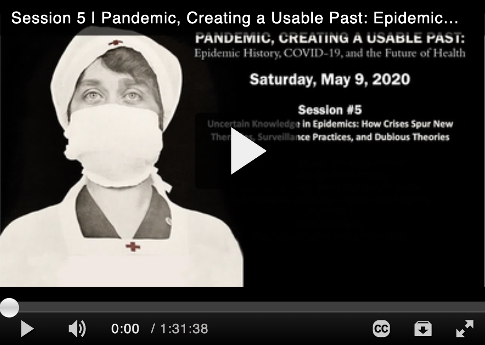

### About

I am Associate Professor in the [Department of History at the University of Iowa](http://clas.uiowa.edu/history/) and affiliated faculty in the in the [Program in Bioethics and Humanities at the Carver College of Medicine](https://medicine.uiowa.edu/bioethics/mission-statement). I specialize in the history of medicine and public health in the Caribbean and Latin America, as well as in histories of empire and disease, race and medicine, and transnational medical practices. I am currently working on a book project on yellow fever knowledge beyond the boundaries of empire in the Caribbean.

### Recent presentations 

<iframe width="560" height="315" src="https://www.youtube.com/embed/fKO8RcpOgDo" frameborder="0" allow="accelerometer; autoplay; encrypted-media; gyroscope; picture-in-picture" allowfullscreen></iframe>

### Recent publications 

["New Directions in the History of Cuban Medicine and Public Health: Introduction to the Dossier," _Cuban Studies_, 45 (February 2017): 275-279](papers/EspinosaCS2017). Electronic copy [available here](https://doi.org/10.1353/cub.2017.0015).  

["The Question of Racial Immunity to Yellow Fever in History and Historiography," _Social Science History_, 38:4 (Fall/Winter 2014): 437-453](papers/EspinosaSSH2014).  (Published online June 17, 2015.) Electronic copy of the journal [available here](http://dx.doi.org/10.1017/ssh.2015.20).  
                
[“Los orígenes caribeños del Sistema Nacional de Salud Pública en los Estados Unidos. Una aproximación global a la historia de la medicina y de la salud pública en Latinoamérica [The Caribbean origins of the National Public Health System in the USA: a global approach to the history of medicine and public health in Latin America]”, _História, ciências, saúde-Manguinhos_ 22:1 (jan./mar. 2015): 241-53](papers/EspinosaManguinhos2015). PubMed PMID: 25742109.  

[“Globalizing the History of Disease, Medicine, and Public Health in Latin America,” _Isis_, 104:4 (December 2013); 798-806.](http://www.jstor.org/stable/10.1086/674946) PubMed PMID 24783496.



### Teaching

I teach undergraduate and graduate courses on the history of Cuba; disease, public health, and empire; the history of medicine and public health in Latin America; disease in the Caribbean; global history of Latin American science and medicine; and global history of science, race, and medicine. Information about courses can be found in [MyUI](https://myui.uiowa.edu/my-ui/courses/dashboard.page).  Current students can access the course website on [ICON](http://icon.uiowa.edu/).

